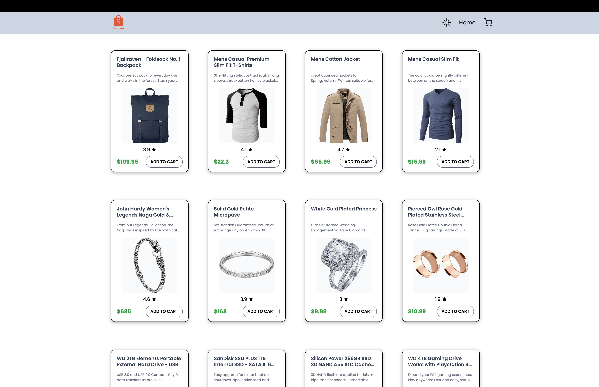
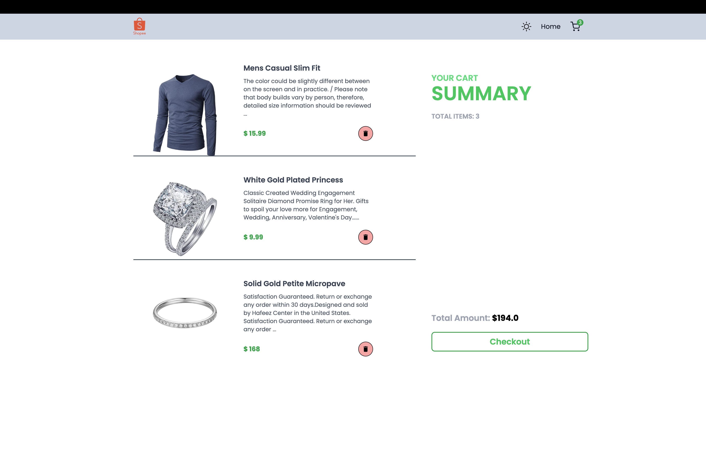
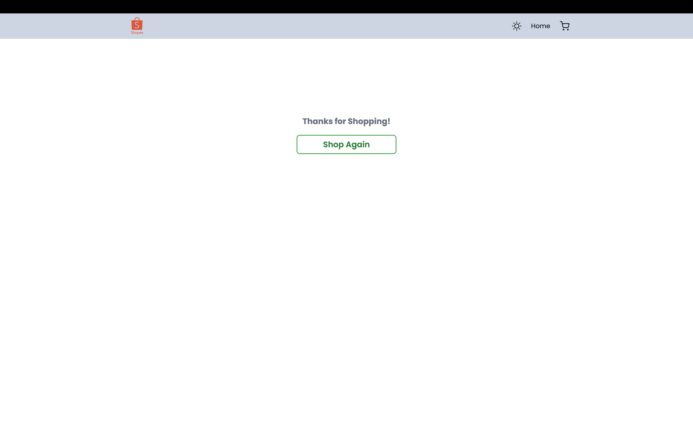

# Shoppee – One place destination for all needs

A modern e-commerce front-end where you can browse products, add them to the cart, and complete a checkout flow. Built with React, Redux, and Tailwind CSS.

---

## Live demo

**[https://shopee-lime.vercel.app/](https://shopee-lime.vercel.app/)**

---

```markdown



```

---

## Features

- **Product listing** – Fetches products from [Fake Store API](https://fakestoreapi.com/); responsive grid with fixed-size cards
- **Shopping cart** – Add/remove items; cart state in Redux with badge in navbar
- **Cart page** – List of items, total amount, and checkout (clears cart and redirects to thank-you page)
- **Dark / light theme** – Toggle in navbar; theme persisted in Redux and applied app-wide
- **Toast notifications** – Feedback for add/remove cart actions (react-hot-toast)
- **Responsive layout** – Grid adapts for mobile, tablet, and desktop

---

## Tech stack

| Category   | Technology        |
|-----------|--------------------|
| Framework | React 19           |
| Build     | Vite 5             |
| State     | Redux Toolkit      |
| Routing   | React Router DOM 7 |
| Styling   | Tailwind CSS 4     |
| Icons     | react-icons        |
| Toasts    | react-hot-toast    |

---

## Getting started

### Prerequisites

- Node.js 18+
- npm (or yarn / pnpm)

### Installation

```bash
# Clone the repository
git clone https://github.com/akash-midha/Shopee.git
cd Shopee

# Install dependencies
npm install

# Start development server
npm run dev
```

Open [http://localhost:5173](http://localhost:5173) in your browser.

### Scripts

| Command         | Description              |
|----------------|--------------------------|
| `npm run dev`  | Start Vite dev server    |
| `npm run build`| Production build (`dist`)|
| `npm run preview` | Preview production build |
| `npm run lint` | Run ESLint               |

---

## Project structure

```
src/
├── components/     # Navbar, Product card, CartItem, Spinner
├── pages/          # Home, Cart, Thanks (post-checkout)
├── redux/          # Store + slices (cart, theme)
├── App.jsx
├── main.jsx
└── index.css
```

---

## API

Product data is loaded from **[Fake Store API](https://fakestoreapi.com/products)** on the Home page. No backend or payment is included; this is a front-end demo.

---

## Deployment

The app is configured for [Vercel](https://vercel.com):

- Build command: `npm run build`
- Output directory: `dist`
- SPA rewrites are set in `vercel.json` so client-side routing works.

---